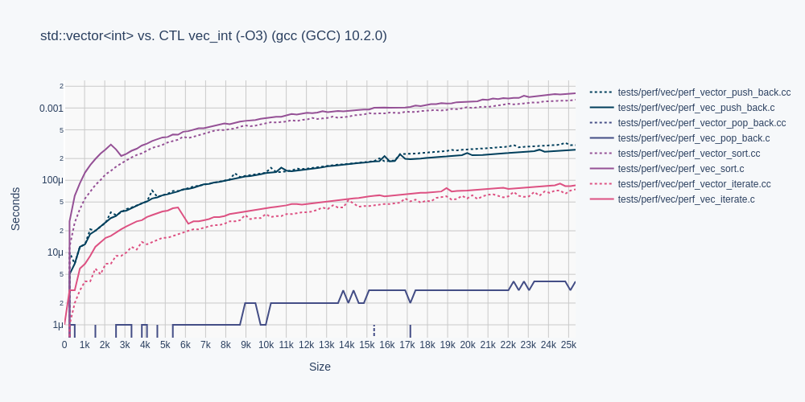
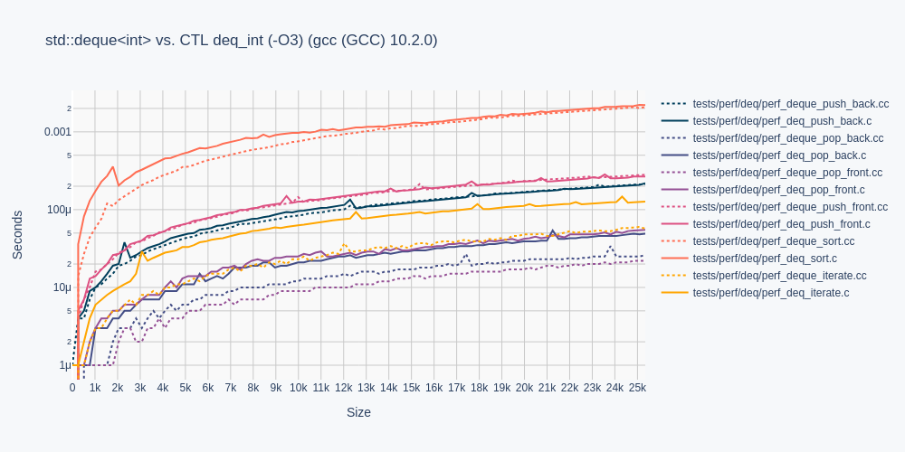
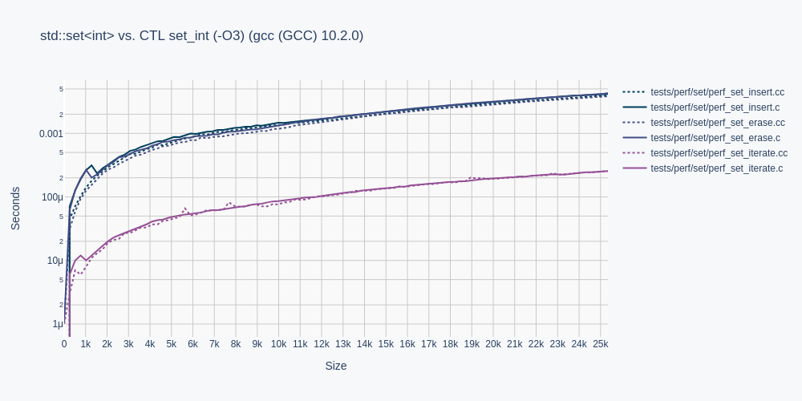

# C TEMPLATE LIBRARY (CTL)

CTL is a fast compiling, type safe, header only, template-like library for ISO C99.

## Motivation

CTL aims to improve C99 developer productivity by implementing the following
STL containers in ISO C99:

    deq.h = std::deque
    lst.h = std::list
    pqu.h = std::priority_queue
    que.h = std::queue
    set.h = std::set
    stk.h = std::stack
    str.h = std::string
    vec.h = std::vector

## Use

Configure a CTL container with a built-in or typedef type `T`.

    #include <stdio.h>

    #define P
    #define T int
    #include <vec.h>

    int compare(int* a, int* b) { return *b < *a; }

    int main(void)
    {
        vec_int a = vec_int_init();
        vec_int_push_back(&a, 9);
        vec_int_push_back(&a, 1);
        vec_int_push_back(&a, 8);
        vec_int_push_back(&a, 3);
        vec_int_push_back(&a, 4);
        vec_int_sort(&a, compare);
        foreach(vec_int, &a, it,
            printf("%d\n", *it.ref);
        )
        vec_int_free(&a);
    }

Definition `P` states type `T` is Plain Old Data (POD).

To compile, include the `ctl` directory:

    gcc main.c -I ctl

For a much more thorough getting started guide,
see the wiki: https://github.com/glouw/ctl/wiki

## Memory Ownership

Types with memory ownership require definition `P` be omitted, and require
function declarations for the C++ equivalent of the destructor and copy constructor,
prior to the inclusion of the container:

    typedef struct { ... } type;
    void type_free(type*);
    type type_copy(type*);
    #define T type
    #include <vec.h>

Forgetting a declaration will print a human-readable error message:

    tests/test_c99.c:11:11: error: ‘type_free’ undeclared (first use in this function)
       11 | #define T type

## Performance

CTL performance is presented in solid colors, and STL in dotted colors,
for template type `T` as type `int` for all measurements.

Omitted from these performance measurements are `que.h`, `stk.h`, and `str.h`,
as their performance characteristics can be inferred from `deq.h`, and `vec.h`,
respectively.

Note, CTL strings do not support short strings.

## Running Tests

To run all functional tests, run:

    make

To compile examples, run:

    make examples

To generate performance graphs, run:

    sh gen_images.sh
    # Graphing requires python3 and the Plotly family of libraries via pip3.

To do all of the above in one step, run:

    ./all.sh

For maintaining CTL, a container templated to type `int` can be
outputted to `stdout` by running make on the container name, eg:

    make deq
    make lst
    make pqu
    make que
    make set
    make stk
    make str
    make vec

## Other

STL `std::map` will not be implemented in CTL because maps only provide slight
syntactic improvements over sets.

STL `std::unordered_map` and `std::unordered_set` will not be implemented in CTL
because ordered containers are preferred, even at the cost of performance.

STL variants of multi-sets and multi-maps will not be implemented because
similar behaviour can be implemented as an amalgamation of a `set` and `lst`.

# Base Implementation Details

vec.h: See `realloc`.
deq.h: Paged `realloc`.
lst.h: Doubly linked list.
set.h: Red black tree.

## Acknowledgements

Thank you `github.com/kully/` for the Plotly code, and thank you for the general review.
