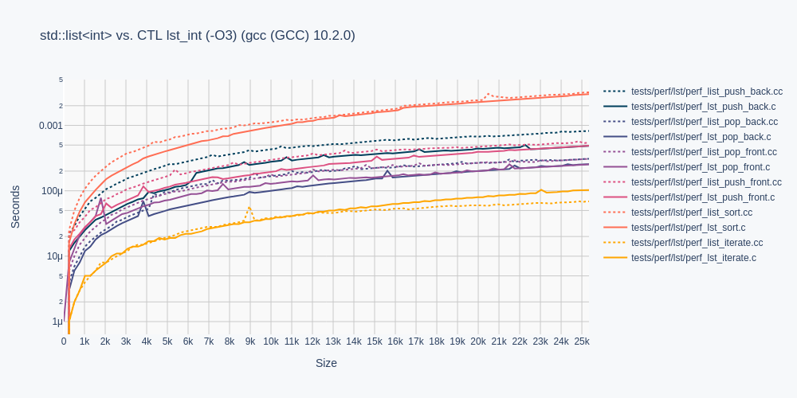
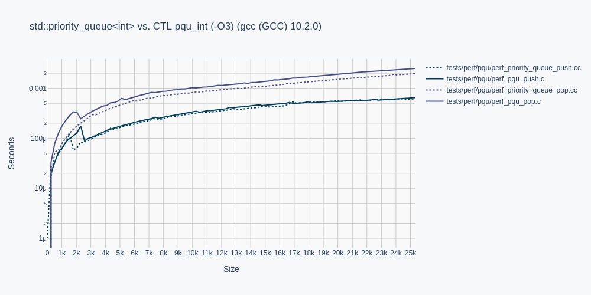

# C TEMPLATE LIBRARY (CTL)

CTL is a fast compiling, type safe, header only, template-like library for ISO C99.

## Motivation

CTL aims to improve C99 developer productivity by implementing the following
STL containers in ISO C99:

    deq.h -> std::deque
    lst.h -> std::list
    map.h -> std::map
    pqu.h -> std::priority_queue
    que.h -> std::queue
    set.h -> std::set
    stk.h -> std::stack
    str.h -> std::string
    vec.h -> std::vector

## Use

Configure a CTL container with a built-in or typedef type `T`.

    #include <stdio.h>

    #define P
    #define T int
    #include <vec.h>

    int compare(int* a, int* b) { return *b < *a; }

    int main(void)
    {
        vec_int a = vec_int_init();
        vec_int_push_back(&a, 9);
        vec_int_push_back(&a, 1);
        vec_int_push_back(&a, 8);
        vec_int_push_back(&a, 3);
        vec_int_push_back(&a, 4);
        vec_int_sort(&a, compare);
        foreach(vec_int, &a, it,
            printf("%d\n", *it.ref);
        )
        vec_int_free(&a);
    }

Definition `P` states type `T` is Plain Old Data (POD).

To compile, include the `ctl` directory:

    gcc main.c -I ctl

## Memory Ownership

Types with memory ownership require definition `P` be omitted, and require
function declarations for the C++ equivalent of the default constructor,
destructor, and copy constructor, prior to the inclusion of the container:

    typedef struct { ... } type;
    type type_init_default(void);
    void type_free(type*);
    type type_copy(type*);
    #define T type
    #include <vec.h>

Forgetting a declaration will print a human-readable error message:

    tests/test_c99.c:11:11: error: ‘type_free’ undeclared (first use in this function)
       11 | #define T type

Maps require `T` and `U` pairs, and do not require an `init_default` declaration:

    typedef struct { ... } type;
    void type_free(int*, type*);
    void type_copy(int*, int*, type*, type*);
    #define T int
    #define U type
    #include <map.h>

Containers requiring more complex initialization (`str.h`, `map.h`, `pqu.h`, `set.h`)
provide a `create` function en-lieu of their `init` functions.

## Performance

CTL performance is presented in solid colors, and STL in dotted colors,
for template type `T` (and `U` for map) as type `int` for all measurements.

Omitted from these performance measurements are `que.h`, `stk.h`, `set.h`, and `str.h`,
as their performance characteristics can be inferred from `deq.h`, `map.h`, and `vec.h`,
respectively.

Of not, CTL strings do not support short strings.

## Running Tests

To run all functional tests, run:

    make

To generate performance graphs, run:

    sh gen_images.sh

Graphing requires python3 and the Plotly family of libraries via pip3.

## Acknowledgements

Thank you `github.com/kully/` for the Plotly code, and thank you for the general review.
